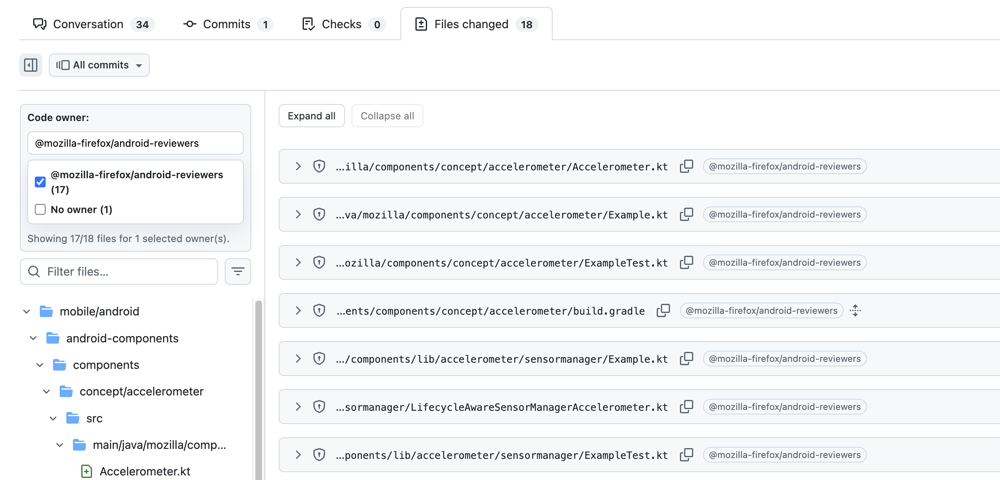
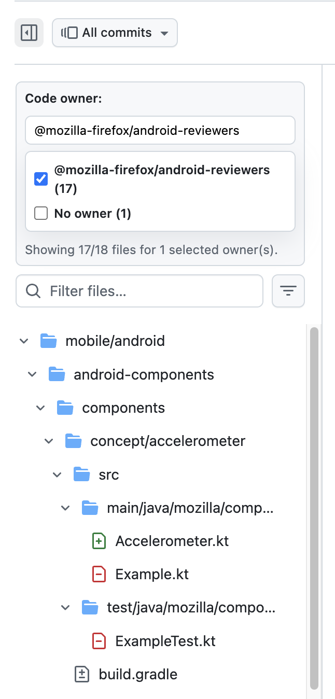
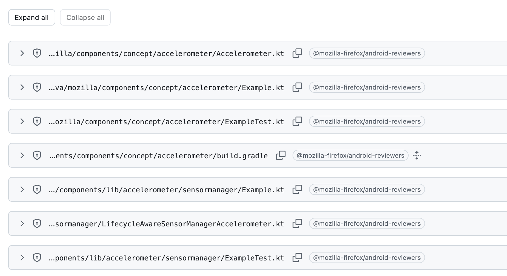

# GitHub PR Toolkit

Browser extension that enhances GitHub Pull Request **changes view** with code-owner focused tooling.

## What it does

- Adds an owner filter panel in the left files sidebar (above the file tree filter controls)
- Filters changed files on the right by selected owner(s)
- Filters file leaf rows in the left tree to match visible files
- Hides folders when all descendant file leaves are hidden
- Adds owner badges in each file header (after copy icon)
- Supports badge hover popups via GitHub hovercard endpoints
- Adds clickable team/user links on owner badges

## Feature screenshots

### Overview

### Sidebar filter + tree sync

### Diff header owner badge + expand/collapse controls

## Project structure

Core content-script logic is split into modules:

- `src/content/shared.js`
  - constants, shared state, DOM helpers, mount target lookup
- `src/content/owners.js`
  - owner parsing, badge rendering, hovercard logic
- `src/content/filtering.js`
  - right diff filtering + left tree filtering
- `src/content/ui.js`
  - filter UI rendering, mounting, owner checkbox list updates
- `src/content/main.js`
  - app orchestration (`tick`, route-change handling, startup)
- `src/styles.css`
  - extension UI + badge + hovercard styles
- `manifest.json`
  - extension metadata + content script load order

## Load in Chrome

1. Open `chrome://extensions`.
2. Enable **Developer mode**.
3. Click **Load unpacked**.
4. Select this root folder.

## Load in Firefox

1. Open `about:debugging#/runtime/this-firefox`
2. Click **Load Temporary Add-on...**
3. Select the repo's `manifest.json`

Note: `manifest.json` includes Firefox-specific `browser_specific_settings.gecko` metadata and still loads locally in Chrome.

## Dev workflow

After code changes:

1. Reload extension in `chrome://extensions` (Reload button)
2. Refresh the target PR changes page
3. Verify:
   - sidebar filter mount location
   - right-side diff filtering
   - left tree filtering
   - owner badge rendering and hovercard behavior

## Notes

- Extension runs on `https://github.com/*` and is intended for PR changes pages.
- Mounting uses structure/id-based selectors (not UI text matching) where possible.
- `manifest.json` is the only manifest needed for local Chrome + Firefox testing.
